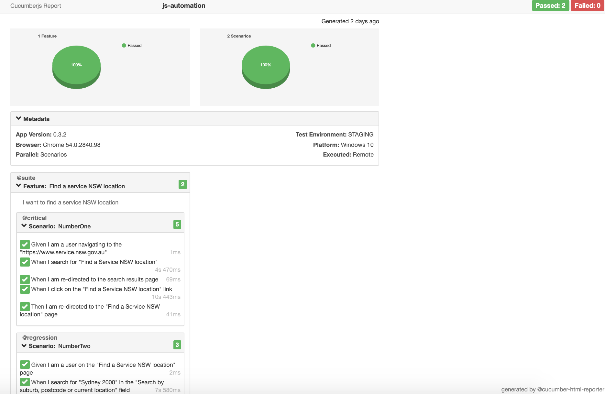

# UI Automation of service NSW using javascript

## Key features:
* This UI Automation project is developed for testing 'Find a Service NSW location' feature of https://www.service.nsw.gov.au
Following are the tech highlights:
    * Programming language: javascript
    * Test framework: cucumber
    * Webdriver: selenium
    * Assertion library: node js assert
    * Build tool: npm
    * Reporter: cucumber-html-reporter
    * Browser support: chromedriver(Chrome), geckodriver(FireFox).
* This project uses cucumber test framework for its BDD support and for the ease of setup and execution.
* This project uses page object pattern to avoid tests being too sensitive to UI changes.
* This project uses data driven approach in order to keep data separate from functional test logic and to aid with quick scaling.
* This project uses selenium web driver for browser automation, for its reliability and multi browser support.
* This project is dockerized to avoid lengthy installation steps for the consumer.

## Scenarios covered
* Scenario:
Given I am a user navigating to the https://www.service.nsw.gov.au And I search for 'Find a Service NSW location'
And I am re-directed to the search results page
When I click on the 'Find a Service NSW location' link
Then I am re-directed to the 'Find a Service NSW location' page


* Scenario:
Given I am a user on the 'Find a Service NSW location' page
When I search for 'Sydney 2000' in the 'Search by suburb, postcode or current location' field Then I should see 'Marrickville Service Centre' and its address returned in the results.

    * Solution for above Scenario #2 is available in test/step_definitions/nsw-service-centre.js

Tests can be run using chrome and firefox.

## Installation/Pre-requisite
#### Dockerization as solution for OS agnostic test runs
This project is dockerized to avoid installation steps(which are OS specific) and to facilitate smooth running of tests. Below commands build and run the Dockerfile.

```
docker build -t js-automation .
docker run js-automation
```

For easy execution in unix environment we have a shell script to build and run docker
```
sh dockerrun.sh
```
#### Commands for individual tests/test suite runs

```
To run test suite for chrome browser: npm run test-chrome
To run critical cases for chrome browser: npm run test-chrome-critical
To run regression cases for chrome browser: npm run test-chrome-regression
To run test suite for firefox browser: npm run test-firefox
To run critical cases for firefox browser: npm run test-firefox-critical
To run regression cases for firefox browser: npm run test-firefox-regression

Finally, run command "node index.js" to get reports in readable format.
```

## Run results
Sample screenshot of run results


## Future Enhancements
* Integration with browser stack for rich browser testing experience.
* Hook the tests to CI/CD pipeline to enable continous integration and development.
* Provide capability for code coverage to instrument the developement code and then run these tests to get coverage results achieved with the existing test suite.
* Use static code analysis
